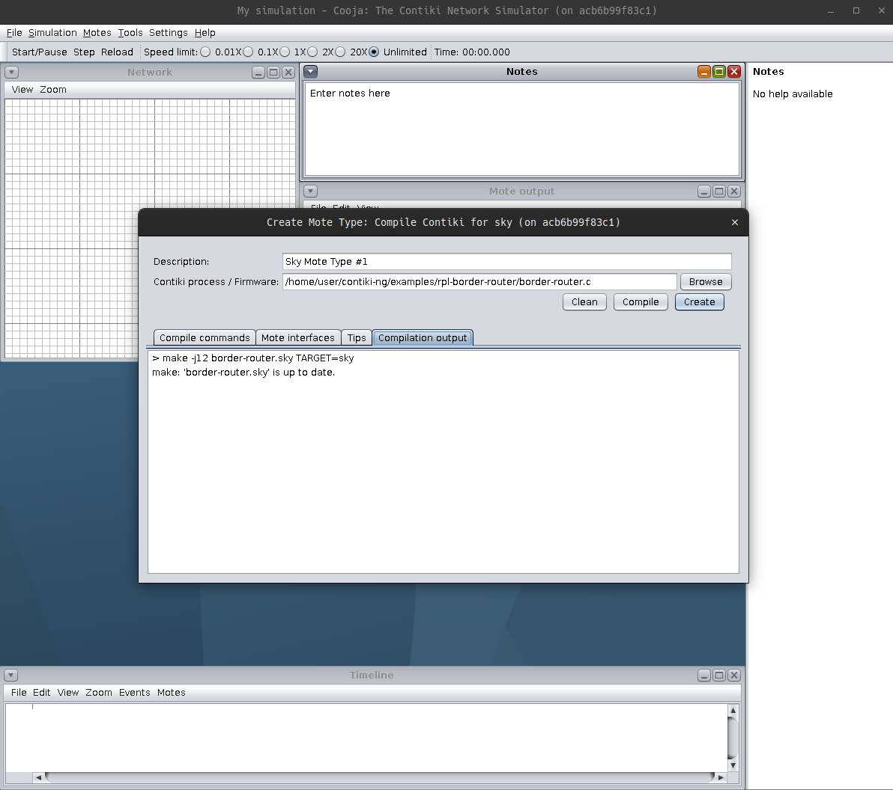
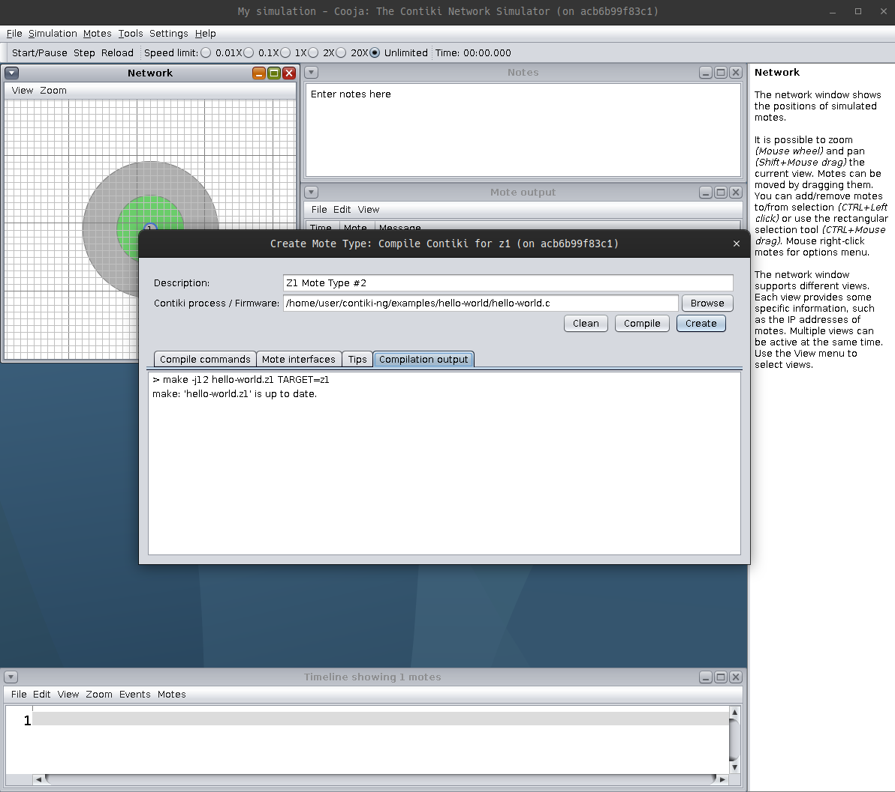
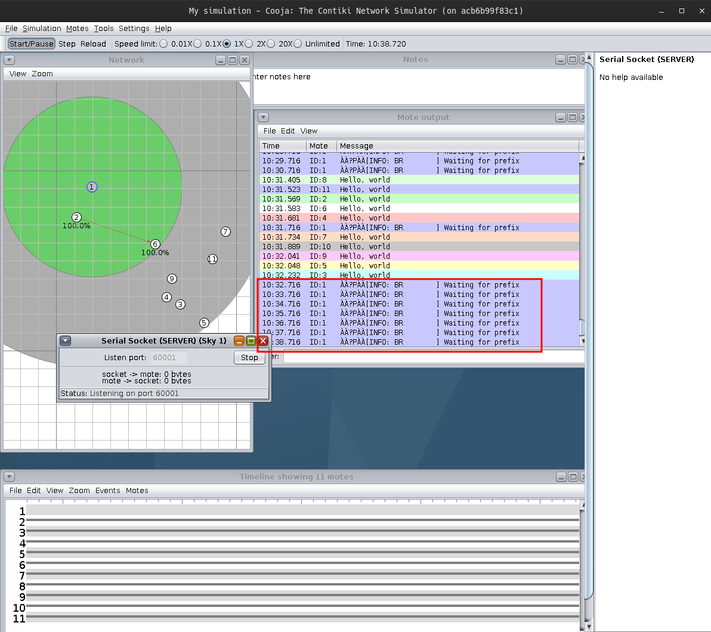
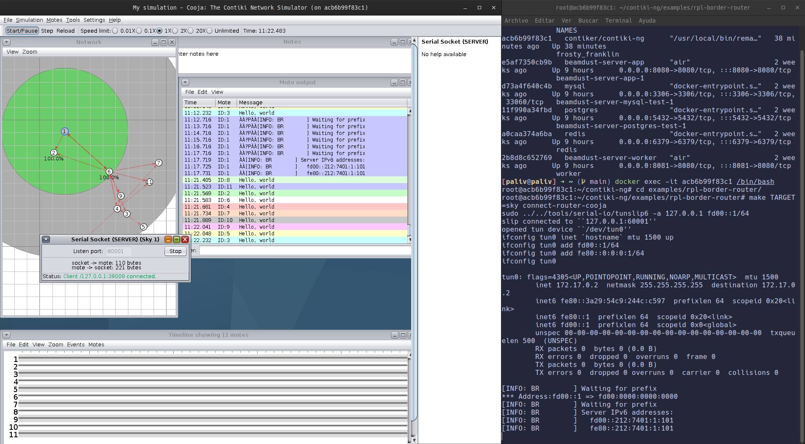
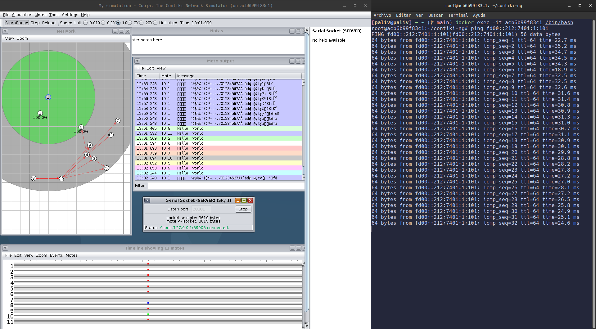

## Ejercicio 5

1. **Configuración de la simulación en Cooja:**
    - Abrir Cooja y crear un mote de tipo sky para utilizar como router de borde (ya que ahí funciona el router de borde; /contiki-ng/examples/rpl-border-router/border-router.c)
    
    - Habilitar el serial socket (SERVER) en el puerto 60001.
    - Agregar 10 motas z1 usando el archivo hello-world.c.
    
    

2. **Ejecución inicial:**
    - Al iniciar la ejecución, el router de borde indica que está esperando un prefijo, por lo que me conecto a la instancia de docker para dárselo.
    
    
3. **Compilación del router de borde:**
    - Dentro del contenedor, voy a la carpeta donde está el código del router de borde y ejecuto un make con el router cooja.
        ```bash
        docker ps
        CONTAINER ID   IMAGE                ...
        acb6b99f83c1   contiker/contiki-ng  ...

        docker exec -it acb6b99f83c1 /bin/bash    
        cd examples/rpl-border-router/
        make TARGET=sky connect-router-cooja
        ```
    
   
4. **Verificación del correcto funcionamiento:**
    - Ejecutando ping puedo ver las comunicaciones y los bytes transferidos entre motas.
    

---