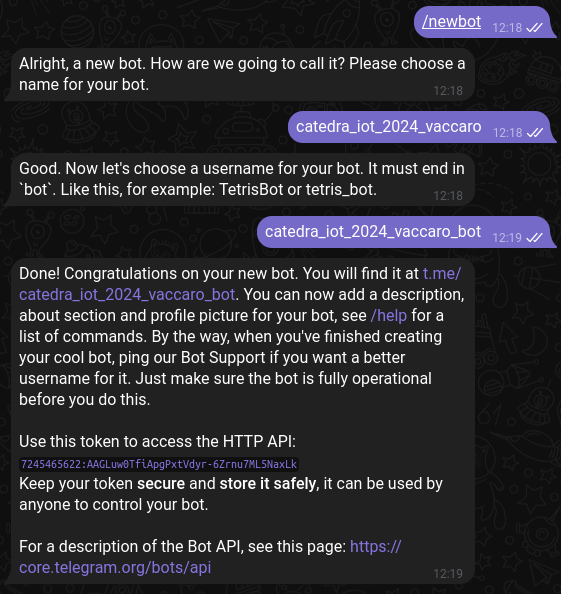
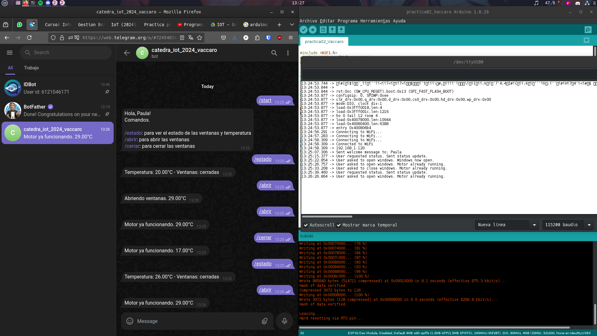
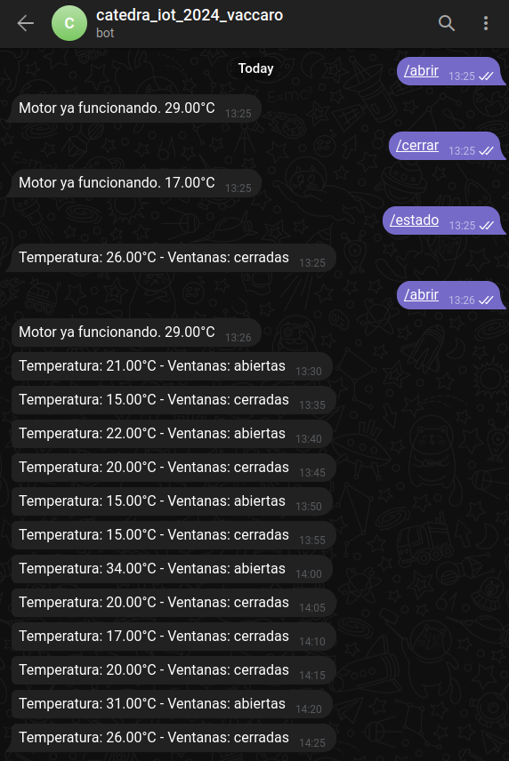

## Creacion de bot de Telegram

Se crea el bot catedra_iot_2024_vaccaro usando BotFather.

    

Se obtiene el id del usuario

    

## Desarrollo

Se instala la biblioteca `UniversalTelegramBot` para simplificar la integración de las funcionalidades del bot en el microcontrolador ESP32. Se conecta el ESP32 a mi red wifi local mediante las credenciales para comunicarse con el mismo.

Se definen las variables:
- ventanaAbierta (bool): indica si las ventanas estan abiertas.
- motorActivo (bool): indioca si el motor que controla las ventanas esta activo. Utilizado para evitar la ejecucion de solicitudes simultáneas.
- lastTimeActive (long): tiempo en milisegundos en el que se activo por última vez el motor.
- outputActiveTime (long): tiempo máximo en milisegundos que el motor debe permanecer activo cada vez que se solicita una acción de apertura o cierre de ventanas.
- lastMsgTime (long): tiempo en milisegundos en el que se envió por última vez un mensaje al bot de Telegram. Utilizado para enviar actualizaciones regulares de estado cada 5 minutos.

Además de enviar mensajes al bot de Telegram para notificar al usuario sobre el estado y las acciones realizadas, se imprime en el monitor de Arduino para depurar y monitorear el flujo del programa en tiempo real.

Más allá de que la velocidad del monitor serie coincide con la indicada en el código (115200 baudios), a veces falla la inicialización. Se agrega un delay de 1 segundo para garantizar que la conexión serie se inicialice correctamente.

## Interaccion con el bot

Después de cargar el código compilado en el ESP32, se inician y verifican las interacciones a través del bot de Telegram.

    

También es posible ver que los mensajes automáticos (actualizaciones cada 5 minutos del estado) funcionan correctamente, ya que me fui a comer y me olvidé de frenar la ejecución.

    

